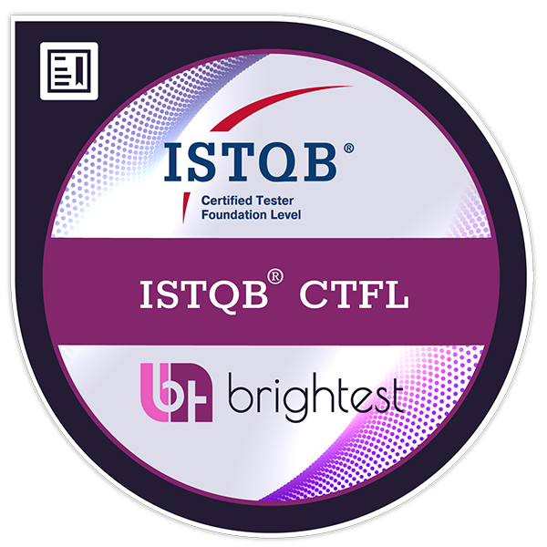
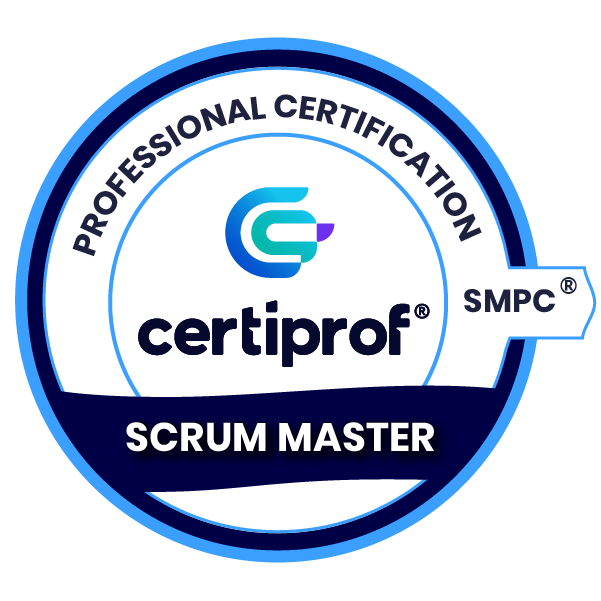

# 👋 Hi, I'm McGlory Tovar

### QA Analyst | QA Automation | Industrial Maintenance Planner

Welcome to my GitHub!

I'm a QA Analyst with a background in Industrial Maintenance Engineering and over 15 years of experience in planning, process optimization, and continuous improvement.

Today, I'm focused on expanding my skills in **QA Automation**, building practical projects with **Playwright** and **JavaScript**, while continuously learning modern testing practices.

---
📜 Certifications

  

  

---
## 🚀 Currently Learning

---

## 🛠 Tech Stack

### Testing

### Languages

### Tools & Platforms

---
### 📊 Productivity & Analytics

---

## 🌱 My Goal

I'm actively growing my skills in QA Automation by creating hands-on projects and exploring new testing techniques.

My objective is to build reliable, maintainable, and scalable automated tests while continuing to grow as a QA professional.

---

## 📂 Featured Projects

🎭 Playwright Tests Practice

A collection of end-to-end automation exercises using Playwright.

More projects coming soon...

---

## 💡 A Little About Me

I enjoy solving problems, improving processes, and learning new technologies.

My previous experience in industrial maintenance taught me to analyze systems, identify risks, and focus on quality—skills that naturally complement my work in software testing.

I believe continuous learning is one of the most valuable qualities in technology.

---

## 📫 Let's Connect

💼 LinkedIn: *https://www.linkedin.com/in/mcglorytovar-t3st3rqa/*

🌎 Location:  Argentina /   Chile
